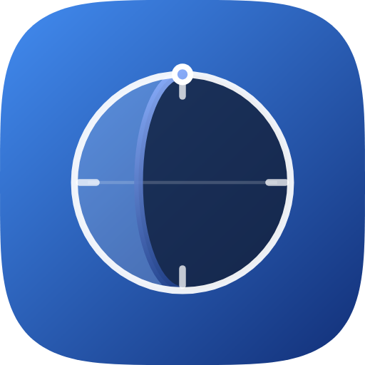
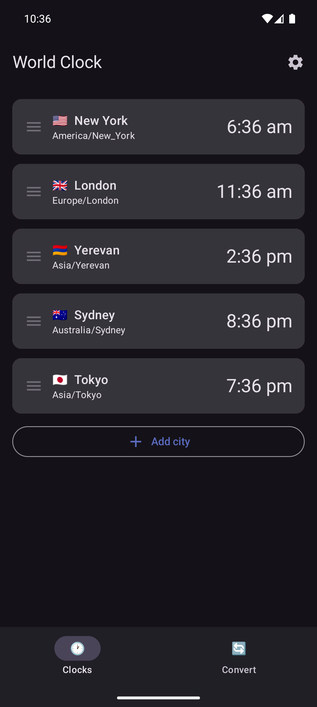
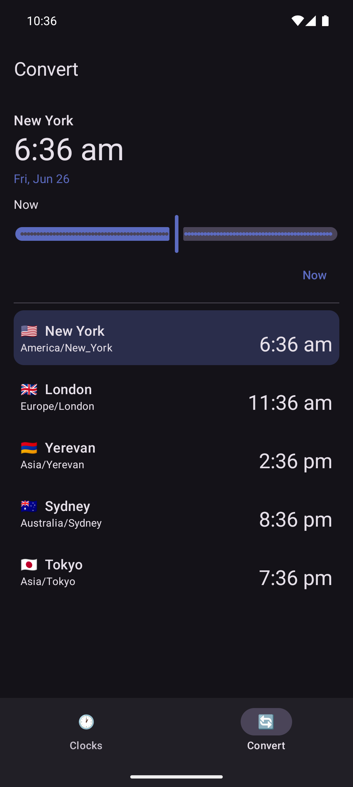
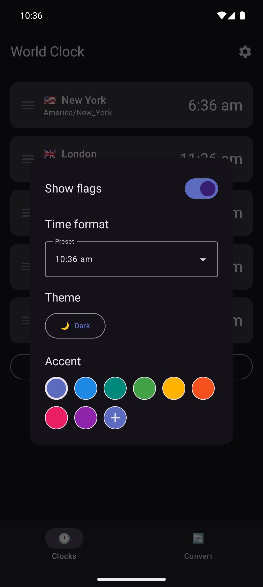

  

<h1 align="center">Zham</h1>

A clean, fast world clock for Android -- see the time across the world, on your home screen, with a built-in time-zone converter.

<em>zham (ժամ)</em>

  

  coming soon...
   
    

---

## Features

- 🕐 **World clock** -- track the current time in as many cities as you like, with live seconds and country flags.
- ➕ **Easy to manage** -- search 600+ time zones to add a city, swipe to delete, drag to reorder.
- 🔄 **Time converter** -- scrub a time *and* date to see the matching moment everywhere at once; pick any city as the reference and spot day rollovers at a glance (**+1d** / **−1d**).
- 🎨 **Make it yours** -- Light / Dark / System theme and any accent color, via a colour wheel.
- 📲 **Home-screen widget** -- resizable, scrollable, matches your theme, and stays in sync as you change your cities.
- ⏱️ **Flexible format** -- 12-hour / 24-hour presets, or your own custom pattern.

## Screenshots

  
  &nbsp;
  
  &nbsp;
  

## Install

**[Get it on F-Droid](https://f-droid.org/packages/io.github.haykh.zham/)** — recommended, with automatic updates.

Or grab the latest `zham-*.apk` from the [**Releases**](../../releases) page and open it on your phone. Requires **Android 8.0 (API 26)** or newer; your browser or file manager may ask you to allow installing apps from this source.

## Privacy

Zham runs entirely offline -- no accounts, no network access, no tracking. Your cities and settings never leave your device.

## License

Zham is free software, released under the [GNU General Public License v3.0](LICENSE.md) (or later).

---

Building Zham yourself? See [DEV.md](DEV.md) for the NixOS / devenv setup and build workflow.

This app was almost entirely written with [Claude](https://claude.ai)
